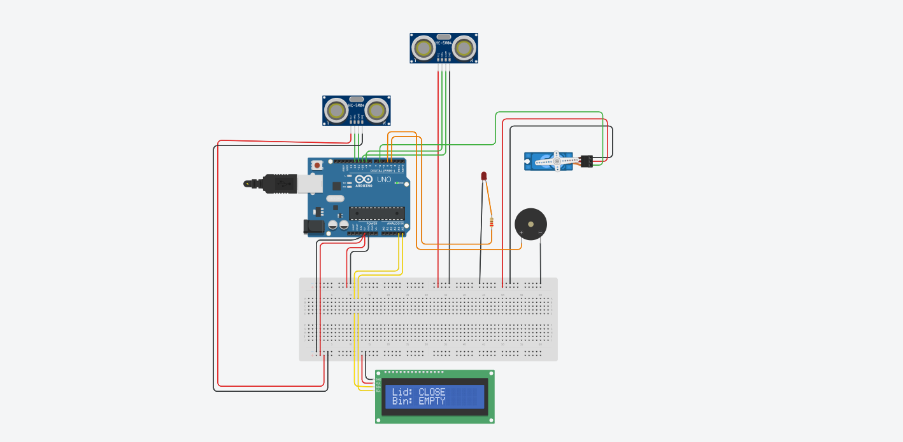

# 🗑️ Smart Garbage Bin using Arduino UNO

A Smart Garbage Bin is an IoT-based automation project built using **Arduino UNO**.  
The system is designed to provide a **touchless and hygienic waste disposal solution** using sensors and automation.

The project uses **two HC-SR04 Ultrasonic Sensors**:

- **Sensor 1 (Outside the Bin):**  
  Detects when a person comes close to the dustbin and automatically opens the lid using a Servo Motor.

- **Sensor 2 (Inside the Bin):**  
  Monitors the garbage level inside the bin and checks whether the bin is full or empty.

When the garbage level becomes full:
- The **LCD Display** shows the status.
- The **Buzzer** gives an alert.
- The **LED** turns ON for indication.

This project demonstrates the practical implementation of **IoT, Automation, and Embedded Systems** in smart waste management.

# 🔧 Components Used

- Arduino UNO
- 2 × HC-SR04 Ultrasonic Sensors
- Servo Motor
- 16x2 I2C LCD Display
- Buzzer
- LED
- Breadboard
- Jumper Wires

---

# 🔌 Connections

## Ultrasonic Sensor 1 (Human Detection)

| HC-SR04 Pin | Arduino UNO |
|---|---|
| VCC | 5V |
| GND | GND |
| TRIG | Digital Pin 9 |
| ECHO | Digital Pin 10 |

---

## Ultrasonic Sensor 2 (Garbage Level Detection)

| HC-SR04 Pin | Arduino UNO |
|---|---|
| VCC | 5V |
| GND | GND |
| TRIG | Digital Pin 12 |
| ECHO | Digital Pin 11 |

---

## Servo Motor Connection

| Servo Pin | Arduino UNO |
|---|---|
| VCC | 5V |
| GND | GND |
| Signal | Digital Pin 6 |

---

## LCD Display (I2C)

| LCD Pin | Arduino UNO |
|---|---|
| VCC | 5V |
| GND | GND |
| SDA | A4 |
| SCL | A5 |

---

## LED & Buzzer

| Component | Arduino UNO |
|---|---|
| LED | Digital Pin 3 |
| Buzzer | Digital Pin 4 |

---

# 🚀 Features

- Automatic Lid Opening
- Touchless Operation
- Garbage Level Detection
- LCD Status Monitoring
- Full Bin Alert System
- Smart Waste Management

---

# 👨‍💻 Author

**Arghadip Biswas**  
Email - mrarghadipofficial@gmail.com