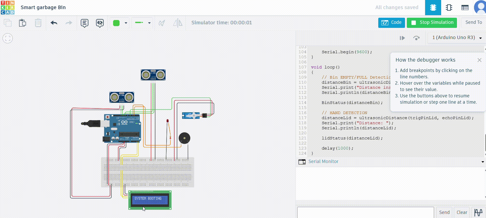
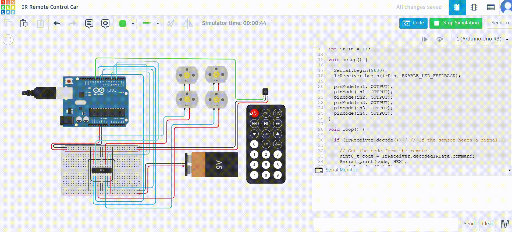

# 🚀 IoT Projects Repository - IoT Vault
---

Welcome to this repository containing multiple IoT & Automation-based projects built for learning, experimentation, and real-world problem solving.

This repository showcases different innovative projects related to:
- IoT Automation
- Smart Embedded Systems
- Robotics
- Sensor-Based Automation

# 📂 Projects Included
---
## 🗑️ 1. Smart Garbage Bin
An IoT-based automated smart dustbin designed to improve hygiene and modernize waste management systems.

The project automatically opens the lid when a person approaches the bin and also monitors the garbage level inside the dustbin. It combines automation with smart sensing technologies to create a touch-free and intelligent waste disposal system.

[View the Repository](https://github.com/arghadip2002/IoT-Vault/tree/main/P1_Smart_Garbage_Bin)

### 🎥 Project Demo

### ✨ Features
- Automatic lid opening system
- Smart garbage level monitoring
- LCD status display
- Alert system using buzzer and LED
- Touch-free operation
- Smart city & hygiene-oriented concept

### 🛠️ Technologies Used
- Arduino UNO
- Ultrasonic Sensors
- Servo Motor
- LCD Display
- Buzzer & LEDs

---

## 🚗 2. IR Remote Control Car
A wireless robotics project built using Arduino UNO and IR communication technology.

This project allows a robotic car to be controlled using an IR Remote Control. The Arduino reads IR signals through an IR Receiver Module and controls the movement of the motors using the L293D Motor Driver IC.

The car can perform multiple movement operations including forward, backward and stop actions.

[View the Repository](https://github.com/arghadip2002/IoT-Vault/tree/main/P2_IR_based_RC_Car)

### 🎥 Project Demo

### ✨ Features
- Wireless IR remote-based control
- Forward & backward movement
- Real-time motor controls
- Simple automation project for beginners

### 🛠️ Technologies Used
- Arduino UNO
- IR Receiver Module
- IR Remote
- L293D Motor Driver
- DC Motors
- 9V Battery

---
---

More projects will be added soon 🚀

### Contributors

1. **Arghadip Biswas** 
- [LinkedIn](https://www.linkedin.com/in/arghadip-biswas2002/)
- [Instagram: @mr_arghadip.official](https://www.instagram.com/mr_arghadip.official/)
- [Github: arghadip2002](https://github.com/arghadip2002)
- Email - mrarghadipofficial@gmail.com